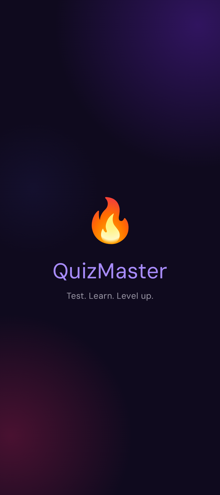
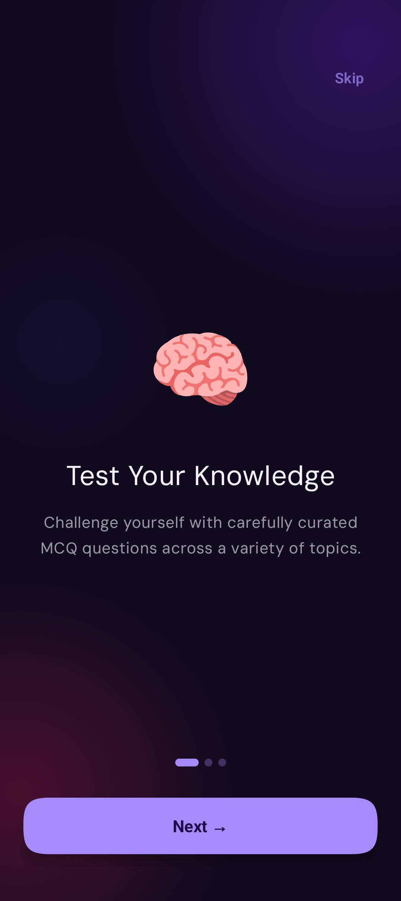
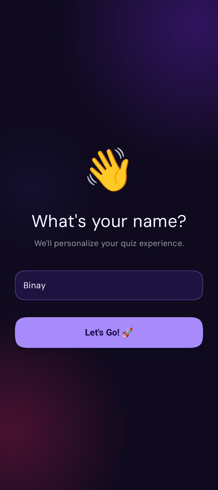
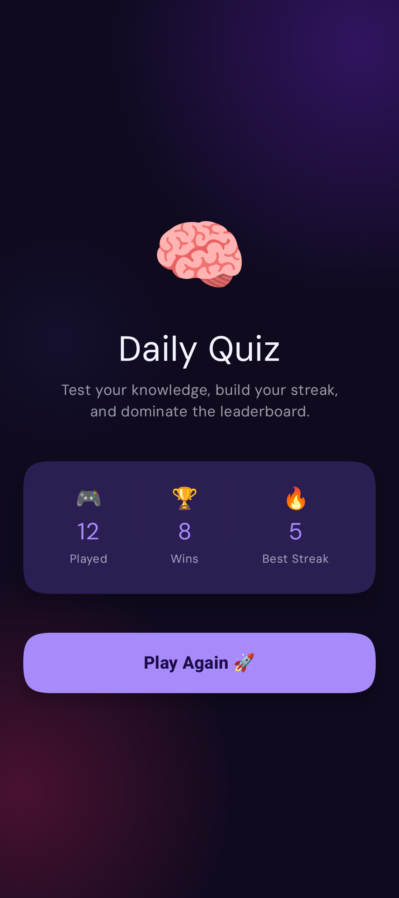
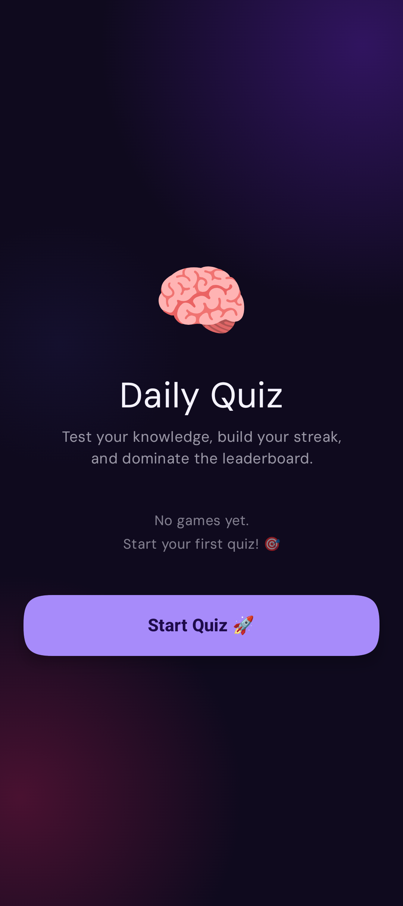
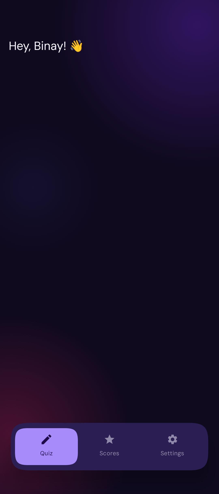
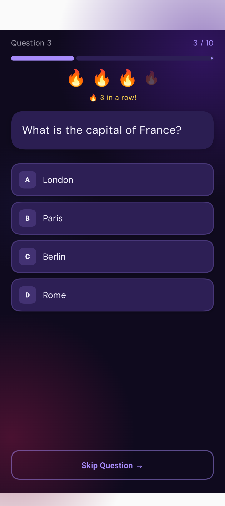
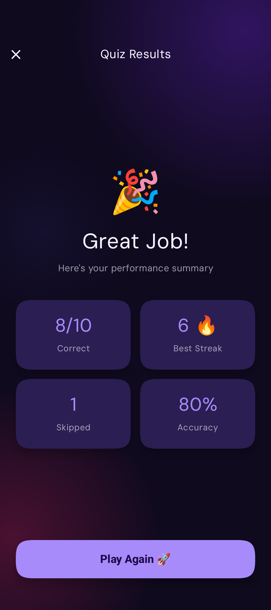
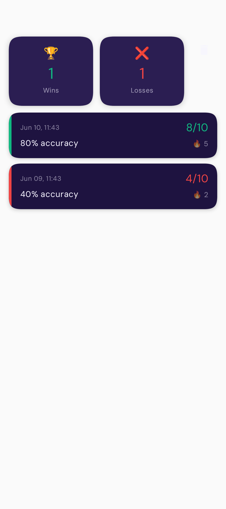
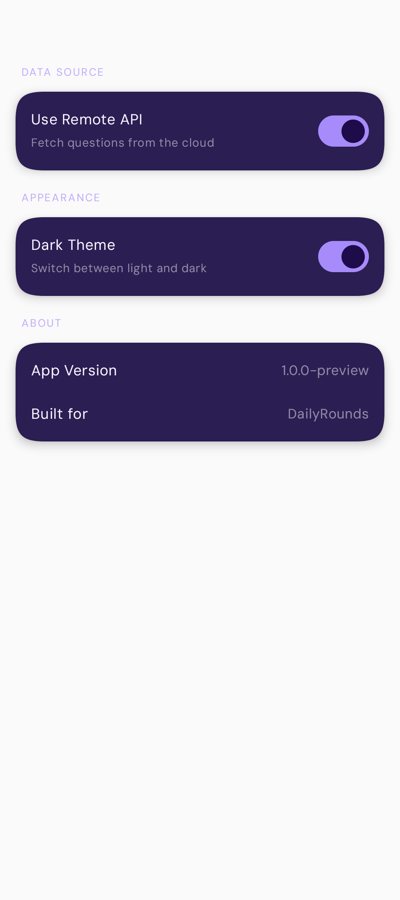

# DailyRounds MCQ Quiz App

A polished Android quiz app built with Jetpack Compose, Hilt, Room, and Ktor for the DailyRounds interview assignment.

---

## Assignment Requirements

| Requirement | Status |
|---|---|
| Parse JSON questions on launch | ✅ Local asset + remote Ktor fallback |
| Splash / loading indicator | ✅ Animated fade-in splash with ViewModel |
| Question screen with 4 options | ✅ Instant correct/wrong feedback |
| Auto-advance after 2 s | ✅ `delay(2000)` + state reset |
| Skip button | ✅ Instant next question |
| Streak logic — badge at 3+ | ✅ Flame icons + animated badge |
| Wrong answer resets streak | ✅ |
| Results screen — score, streak, skipped | ✅ Konfetti confetti on restart |
| Restart quiz | ✅ Full state reset |
| Animations & gestures | ✅ Swipe-to-skip, AnimatedContent transitions |
| Architecture — UI / state / data | ✅ Clean data → domain → UI layers |
| Accessibility & material components | ✅ M3 theming, content descriptions |

---

## Features

- **10-question MCQ quiz** loaded from a local JSON asset with remote API fallback (Ktor)
- **Instant answer feedback** — tap an option to reveal correct (green) and wrong (red) answers
- **Auto-advance** — moves to next question 2 seconds after answering
- **Skip** — skip any unanswered question instantly (button or swipe left)
- **Swipe gesture** — swipe left anywhere on the screen to skip
- **Streak system** — 4 flame icons light up as your streak grows; badge appears at 3+ consecutive correct answers
- **Results screen** — shows correct/total score, highest streak, skipped count, and accuracy percentage with confetti animation
- **Leaderboard** — persistent quiz history stored in Room; view past results sorted by date
- **Settings** — dark/light theme toggle, shuffle questions, clear history
- **Onboarding** — first-launch user name entry with animated transitions
- **Splash screen** — animated fade-in while data loads
- **Haptic feedback** — vibration on correct/wrong answer
- **Sound effects** — subtle audio cues for answer feedback

---

## Screenshots

<table>
  <tr>
    <td align="center"><b>Splash</b><br></td>
    <td align="center"><b>Onboarding</b><br></td>
    <td align="center"><b>User Details</b><br></td>
    <td align="center"><b>Quiz Start</b><br></td>
  </tr>
  <tr>
    <td align="center"><b>Quiz Start (First)</b><br></td>
    <td align="center"><b>Home</b><br></td>
    <td align="center"><b>Quiz Loading</b><br></td>
    <td align="center"><b>Quiz</b><br></td>
  </tr>
  <tr>
    <td align="center"><b>Results</b><br></td>
    <td align="center"><b>Leaderboard</b><br></td>
    <td align="center"><b>Settings</b><br></td>
    <td align="center"><b>Streak Flames</b><br></td>
  </tr>
  <tr>
    <td align="center"><b>Option Default</b><br></td>
    <td align="center"><b>Option Correct</b><br></td>
    <td align="center"><b>Option Wrong</b><br></td>
    <td></td>
  </tr>
</table>

---

## Architecture

Clean separation of **data → domain → UI** layers, all wired via Hilt dependency injection.

```
app/src/main/java/com/binayshaw7777/dailyroundsassignment/
├── DailyRoundsApp.kt                     — Application class (@HiltAndroidApp)
├── MainActivity.kt                        — Single activity, setContent
├── data/
│   ├── local/
│   │   ├── db/
│   │   │   ├── QuizDatabase.kt           — Room database definition
│   │   │   ├── QuizResultDao.kt          — DAO for quiz results
│   │   │   └── QuizResultEntity.kt       — Room entity for persisted results
│   │   └── preferences/
│   │       └── AppPreferences.kt         — DataStore preferences (theme, shuffle, user)
│   ├── model/
│   │   ├── Question.kt                   — Domain data class
│   │   └── QuizResult.kt                 — Domain result model
│   ├── remote/
│   │   ├── dto/
│   │   │   └── QuestionDto.kt            — Ktor response DTO
│   │   └── QuizApiService.kt             — Ktor HTTP client for quiz API
│   └── repository/
│       ├── QuizRepositoryImpl.kt         — Local asset JSON reader
│       ├── QuizResultRepositoryImpl.kt   — Room-backed result persistence
│       └── RemoteQuizRepositoryImpl.kt   — Ktor remote question fetcher
├── di/
│   ├── DatabaseModule.kt                 — Hilt module: Room + DataStore providers
│   ├── RepositoryModule.kt               — Hilt module: repository bindings
│   └── qualifiers.kt                     — @LocalQuiz / @RemoteQuiz qualifiers
├── domain/
│   ├── repository/
│   │   ├── QuizRepository.kt             — Repository interface
│   │   └── QuizResultRepository.kt       — Result repository interface
│   └── usecase/
│       ├── LoadQuestionsUseCase.kt        — Load + optional shuffle
│       ├── SaveQuizResultUseCase.kt      — Persist a result
│       ├── GetQuizHistoryUseCase.kt      — Flow<List<QuizResult>>
│       ├── GetLatestQuizResultUseCase.kt — Most recent result
│       └── ClearQuizHistoryUseCase.kt    — Wipe leaderboard
├── ui/
│   ├── components/
│   │   ├── AppText.kt                    — Reusable styled Text
│   │   └── QuizComponents.kt            — OptionButton, StreakFlames, StreakProgressRing
│   ├── home/
│   │   └── HomeScreen.kt                — Post-onboarding landing
│   ├── leaderboard/
│   │   ├── LeaderboardScreen.kt         — History list
│   │   ├── LeaderboardUiEvent.kt
│   │   ├── LeaderboardUiState.kt
│   │   └── LeaderboardViewModel.kt
│   ├── navigation/
│   │   ├── AppNavigation.kt             — NavHost wiring all screens
│   │   └── Screen.kt                    — Route sealed class
│   ├── onboarding/
│   │   ├── OnboardingScreen.kt          — First-launch name entry
│   │   ├── OnboardingUiEvent.kt
│   │   ├── OnboardingUiState.kt
│   │   └── OnboardingViewModel.kt
│   ├── quiz/
│   │   ├── QuizScreen.kt                — State holder + pure QuizContent
│   │   ├── QuizUiEvent.kt
│   │   ├── QuizUiState.kt
│   │   └── QuizViewModel.kt
│   ├── quizstart/
│   │   └── QuizStartScreen.kt           — Pre-quiz start prompt
│   ├── results/
│   │   ├── ResultsScreen.kt             — Score + confetti + restart
│   │   ├── ResultsUiEvent.kt
│   │   ├── ResultsUiState.kt
│   │   └── ResultsViewModel.kt
│   ├── settings/
│   │   ├── SettingsScreen.kt            — Theme toggle, shuffle, clear history
│   │   ├── SettingsUiEvent.kt
│   │   ├── SettingsUiState.kt
│   │   └── SettingsViewModel.kt
│   ├── splash/
│   │   ├── SplashScreen.kt              — Animated 1.5 s fade-in
│   │   ├── SplashUiEvent.kt
│   │   ├── SplashUiState.kt
│   │   └── SplashViewModel.kt
│   ├── theme/
│   │   ├── Color.kt                     — shadcn zinc palette (light + dark)
│   │   ├── Theme.kt                     — Material 3 dynamic theme
│   │   └── Type.kt                      — DM Sans typography scale
│   └── userdetails/
│       ├── UserDetailsScreen.kt
│       ├── UserDetailsUiEvent.kt
│       ├── UserDetailsUiState.kt
│       └── UserDetailsViewModel.kt
└── util/
    ├── HapticUtils.kt                   — Vibration helpers
    ├── QuizMath.kt                      — Score / accuracy calculations
    └── SoundManager.kt                  — MediaPlayer lifecycle management
```

**Patterns used:**
- **State holder / UI split** — every screen has a ViewModel-wired composable + a pure UI composable that takes plain state and callbacks; the pure composable is fully previewable
- **StateFlow + `update {}`** — all state mutations use `MutableStateFlow.update { }` for atomic, race-safe updates
- **Channel(BUFFERED).receiveAsFlow()** — one-shot navigation effects (navigate to results) to avoid event loss
- **Use cases** — domain logic in single-responsibility use cases called by ViewModels
- **Hilt DI** — all repositories and database instances injected via `@Inject constructor`; qualifier annotations distinguish local vs remote quiz sources
- **No business logic in composables** — ViewModels own all quiz logic

---

## Quiz Flow

```
Splash (1.5 s) → Onboarding (first launch) → Home
                                                ↓
                                          Quiz Start → Question 1–10 → Results
                                              ↑              ↑              |
                                              └──── Restart ─┘              |
                                              └─────────────────────────────┘
```

**Navigation routes:** `Splash` → `Onboarding` → `Home` → `QuizStart` → `Quiz` → `Results` → back to `Home`

**Streak logic:**
- Correct answer → streak + 1; update longestStreak
- Wrong answer → streak reset to 0
- At streak ≥ 3 → badge animates in; flame icons light up proportionally
- Streak resets on wrong answer only (skips do not reset streak)

---

## UX & Animations

| Interaction | Animation |
|---|---|
| Tap option | `animateColorAsState` 400 ms color transition |
| Question advance | `AnimatedContent` slide-in from right |
| Streak badge | `AnimatedVisibility` fade in/out |
| Streak flames | `animateColorAsState` per flame icon |
| Splash | `Animatable` alpha fade-in |
| Confetti (results) | Konfetti `KonfettiView` burst |
| Swipe to skip | `detectDragGestures` with threshold |
| Haptic feedback | `HapticUtils` vibration on answer |
| Sound cues | `SoundManager` MediaPlayer playback |

---

## Edge Cases Handled

- **Double-tap guard** — `selectOption` and `skipQuestion` are no-ops if `isAnswered == true`
- **Swipe during answered state** — swipe gesture disabled while auto-advance delay is active
- **Empty JSON** — shows "No questions available" message
- **Malformed JSON** — `runCatching` in repository; loading state clears gracefully
- **Remote API failure** — graceful fallback to local asset questions via Ktor `runCatching`
- **First launch** — onboarding flow forces name entry before quiz
- **DataStore persistence** — theme and shuffle preferences survive process death

---

## Tech Stack

| Library | Version | Purpose |
|---|---|---|
| Jetpack Compose BOM | 2026.02.01 | UI toolkit |
| Material 3 | BOM | Components and theming |
| Navigation Compose | 2.9.0 | Screen navigation |
| Lifecycle ViewModel Compose | 2.9.0 | ViewModel integration |
| Lifecycle Runtime Compose | 2.9.0 | `collectAsStateWithLifecycle` |
| Hilt | 2.59.2 | Dependency injection |
| Room | 2.7.1 | Local result persistence |
| Ktor | 3.1.3 | Remote question fetching |
| DataStore Preferences | 1.1.4 | User settings persistence |
| Kotlinx Serialization | 1.8.1 | JSON serialization |
| Kotlin Coroutines | 1.10.2 | Async operations |
| Konfetti | 2.0.5 | Confetti animation on results |
| Squircle Shape | 4.0.0 | Rounded UI shapes |
| Timber | 5.0.1 | Logging |

**Min SDK:** 24 &nbsp;|&nbsp; **Compile SDK:** 37 &nbsp;|&nbsp; **Target SDK:** 36 &nbsp;|&nbsp; **Language:** Kotlin

---

## Building

```bash
./gradlew assembleDebug
```

APK output: `app/build/outputs/apk/debug/app-debug.apk`
